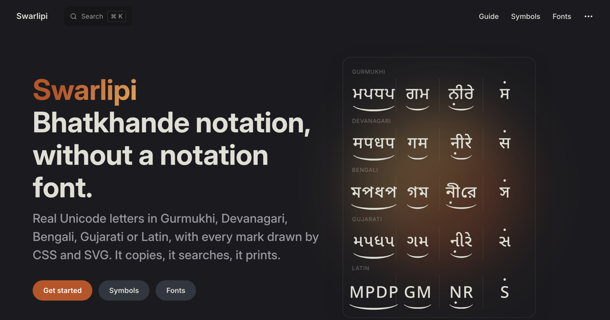

# Swarlipi



Fontless Bhatkhande (Hindustani) notation renderer. Turns the compact ASCII
notation grammar (`s r g m`, `R G M D N` for komal/tivra, `u`/`l` octave
markers, `{kan}`, chhand `@#$%^&*`, meend `q w W e`, ghaseet `Q E`, bols
`; ' [ ] \`) into real Unicode text in Gurmukhi, Devanagari, Bengali, Gujarati
or Latin,
with every notation mark drawn by CSS and inline SVG instead of a custom font.

- Framework-agnostic: returns an HTML string. SSR-safe, no DOM access.
- Zero runtime dependencies.
- Sizing is pure `em`, colours use `currentColor`, marks are border/SVG ink so
  they print without "background graphics".
- The **Swarlipi fonts** (see Fonts) cover the one thing CSS can't: making
  copied plain text render its marks in any app that has the font.

## Install

```sh
npm install swarlipi
```

ESM only, TypeScript types included, no runtime dependencies. Entry points:
`swarlipi` (renderer), `swarlipi/style.css`, `swarlipi/bridge` (cross-beat
glides, browser only), `swarlipi/samples`, `swarlipi/reference`, and the
`fonts/` directory. Code is MIT; the fonts are OFL (`fonts/LICENSE`).

## Compatible with the Omenad keymap

The input grammar is the character mapping of the **Omenad Bhatkhande fonts**
(OmeBhatkhande Punjabi, Hindi, Bangla and English): the same letters for the
swaras, capitals for komal and tivra, `u l U L` for the octaves, `{ }` for kan,
`@#$%^&*` for chhand, `q w W e` / `Q E` for meend and ghaseet, `; ' [ ] \` for
the bols. Notation typed for those fonts renders in Swarlipi unchanged —
nothing to convert — and those four map onto Swarlipi's `gurmukhi`,
`devanagari`, `bengali` and `latin`. (`gujarati` has no Omenad counterpart; the
same keymap produces it.) What changes is the output: real text instead of glyph
substitution.

## Usage

```ts
import { renderSwarlipi, swarlipiWrapperClass } from 'swarlipi';
import 'swarlipi/style.css';

const html = renderSwarlipi('@sr{g}m', 'gurmukhi');
// <span class="sl-ch"><span class="sl-n">ਸ</span>…</span>

element.className = swarlipiWrapperClass('gurmukhi');
// "sl-wrap sl-gurmukhi sl-punjabi"  (the original class comes too)
element.innerHTML = html;
```

The wrapper element must carry `swarlipiWrapperClass(script)`; the stylesheet
keys every mark position off the `.sl-<script>` class.

| Script         | Letters         | Face                 |
| -------------- | --------------- | -------------------- |
| `'gurmukhi'`   | ਸ ਰੇ ਗ ਮ ਪ ਧ ਨੀ | Noto Sans Gurmukhi   |
| `'devanagari'` | स रे ग म प ध नी | Noto Sans Devanagari |
| `'bengali'`    | স রে গ ম প ধ নী | Noto Sans Bengali    |
| `'gujarati'`   | સ રે ગ મ પ ધ ની | Noto Sans Gujarati   |
| `'latin'`      | S R G M P D N   | Noto Sans            |

A script id names a **letterform set, not a language** — several languages share
one. Marathi, Nepali and Konkani notation is `'devanagari'`, the same letters
Hindi uses, so a language belongs in your own language list mapped onto one of
these rather than duplicated here. A script is here only when Bhatkhande
notation is actually published in it.

The original four ids `punjabi`, `hindi`, `bangla` and `english` are still accepted as
aliases, and their `.sl-` classes are still emitted, so no migration is needed.

### Contract (things an integrator may touch)

| Hook                | Meaning                                                                                                                     |
| ------------------- | --------------------------------------------------------------------------------------------------------------------------- |
| `.sl-wrap`          | Wrapper. `font-size: calc(1em * var(--sl-scale))`, `line-height: 1.9`.                                                      |
| `--sl-scale`        | Optical bump vs. surrounding text (default `1.08`). Multiply it back in if you override the wrapper's font-size.            |
| `.sl-bold`          | Bold weight (700). Normal weight is 500.                                                                                    |
| `--font-sl`         | Letter face per script (defaults to the Noto Sans script faces; the CSS does **not** fetch fonts — load them yourself).     |
| `.sl-mz`, `.sl-mbr` | Meend / ghaseet mark zones. A cross-beat span is bridged between consecutive zones by `swarlipi/bridge`.                    |
| `[data-sl-bar]`     | A bridging bar. Positioned by the stylesheet: absolute, and anchor-pinned to its zones where the engine supports anchors.   |
| `--sl-mz-h`         | Mark-zone height (`0.34em`). `--sl-bar` multiplies it, so `.sl-mz` must keep taking its height from this variable.          |
| `--sl-bar-ratio`    | Fraction of the zone its bar fills. Mirrors `MEEND_BAR_RATIO` — a test fails if the two drift. Use it, do not re-derive it. |
| `--sl-bar`          | Resulting stroke weight, and the ghaseet bracket's border width.                                                            |
| `--sl-mbr-leg`      | Ghaseet bracket leg length below the bar. Its box is `leg + bar`, so a heavier bar thickens ink without shortening legs.    |

**Derived, do not set:** `--sl-mbr-top` is computed from that script's
`--sl-dot-a-top` minus the W tick's reach (`--sl-tick-reach`, itself the sum of
`--sl-tick-top`, `--sl-tick-gap` and `--sl-tick-h`) and a pixel of clearance.
Every meend therefore sits at ONE height per script, ticked or not, with the
tick hanging inside the band above the taar dot line — the rule the Omenad
faces use, where every marker glyph shares one vertical band whose bottom is
exactly the dot's top. Override the dot line if you must; let the bar follow.

### Plain text

```ts
import { toUnicodeNotation } from 'swarlipi';
toUnicodeNotation('Rl', 'devanagari'); // "रे̱̣"  (letter + combining marks)
```

Marks are Unicode combining characters placed **after** the whole letter
cluster (never between a consonant and its vowel sign, which splits the
syllable in CoreText/Word). Whether they show depends on the destination
font — install a Swarlipi font for guaranteed rendering.

## Fonts

The plain-text export only shows its marks where the destination font can
shape them. The **Swarlipi fonts** fix that: Noto Sans `<Script>` plus the six
combining marks with GPOS anchors, one variable font per script (weight
400–700), renamed because "Noto" is an OFL Reserved Font Name. A font cannot
stretch chhand arcs or meend bars across letters, so the renderer keeps that
role; the font is for "everything else": Word, Pages, PDFs, anywhere the copied
text lands and the font is installed.

The package ships them under `fonts/`: `SwarlipiGurmukhi-Variable`,
`SwarlipiDevanagari-Variable`, `SwarlipiBengali-Variable` and
`SwarlipiGujarati-Variable` as `.ttf` (the install format) and `.woff2` (for the
web), plus `swarlipi-fonts.css` with the `@font-face` rules and the OFL
`LICENSE`. Any npm CDN serves them:

```html
<!-- one link; families "Swarlipi Gurmukhi" / "Devanagari" / "Bengali" / "Gujarati" -->
<link
  rel="stylesheet"
  href="https://cdn.jsdelivr.net/npm/swarlipi@0.2/fonts/swarlipi-fonts.css"
/>
```

Desktop install: download the `.ttf` from the same directory, for example
`https://cdn.jsdelivr.net/npm/swarlipi@0.2/fonts/SwarlipiGurmukhi-Variable.ttf`,
and double-click it.

Each script font also carries **Noto Sans's basic Latin** (letters, digits,
punctuation, same weight axis), so a heading or section label can share the
face with the sargam. It is also what gets the fonts into Apple's menus:
Pages, Keynote and Numbers list only fonts that cover the system language,
which on an English-language Mac hides a Latin-less font from their font
popup. No separate Latin font is built: for Latin-only `english` notation,
**Noto Sans** already carries all six marks with anchors (it is where the
script fonts borrow theirs). Note that San Francisco and Times lack the tivra
mark (U+030D), so tivra in a system font falls back to another face.

Two formats, two jobs: `.woff2` for `@font-face` (a third of the bytes, and
every browser since 2016 takes it), `.ttf` to install (nothing installs a
WOFF2, and it is also the `@font-face` fallback for anything without WOFF2).
Legacy WOFF 1.0 is not built: only IE11 needed it, and the TTF covers that.

### Building them

`scripts/build-fonts.py` builds the fonts from pinned Noto releases (Python
3.10+, `pip install "fonttools[woff]"`). `pnpm --filter swarlipi build:fonts`
writes `fonts/`.

No binary is committed: `fonts/` is git-ignored, as is the `.noto-cache/` of
Noto source zips the build fetches. The package's `prepack` runs the build, so
`pnpm pack` and `pnpm publish` ship `fonts/` inside the tarball and every
published version carries fonts built from its own script. A publish therefore
needs Python and fontTools on the machine doing it; a missing one fails the
publish rather than shipping a package without fonts.

The build is byte-reproducible (timestamps are pinned), and the script with
its pinned Noto releases is the fonts' **only** input — nothing in the
renderer, the stylesheet or the app affects them. Noto stays pinned on
purpose; bumping a pin is a deliberate commit, since new outlines can move
under the anchors.

Verified in HarfBuzz, Chromium (400/500/700, komal width variants included)
and CoreText. Known limits: anchor x is static (ink centre at Regular), so a
bold dot can sit a few units off-centre; Windows Word and LibreOffice are
untested.

## Source and contributing

Swarlipi is developed inside a private monorepo, alongside the notation app it
grew out of. [github.com/BeeJaySoft/swarlipi](https://github.com/BeeJaySoft/swarlipi)
is a mirror of that package directory — same commits, same history, pushed on
every release and whenever the package changes — and it is where issues and
pull requests go. A pull request is not merged on the mirror: it is applied to
the monorepo, lands here with the next push, and is then closed with a pointer
to the commit that carried it. Scripts are added only on primary-source
evidence that Bhatkhande notation is published in them; the Gujarati entry in
`CHANGELOG.md` shows what that evidence looks like.

## Changelog

See [CHANGELOG.md](./CHANGELOG.md).

## Releasing

Manual, and deliberately so: the monorepo's pre-commit hook bumps only
the app, never this package. A library's version is a semver judgement
(patch / minor / major), not something a commit should decide.

From a clean `main` checkout, with Python and fontTools available (`prepack`
builds `dist/` and `fonts/`):

```sh
cd packages/swarlipi
pnpm version patch --no-git-tag-version   # or minor / major
# retitle the CHANGELOG's "Unreleased" section to the version, commit, land it
# on main and push; then, from the repo root:
pnpm swarlipi:publish
```

`swarlipi:publish` checks its preconditions (clean main in sync with origin, a
version not yet on npm, its CHANGELOG section, npm and GitHub logins, Python
with fontTools) before pushing anything, then runs three steps and stops at
the first failure: `pnpm swarlipi:mirror --tag` (public source + `vX.Y.Z` tag),
`pnpm publish --access public` in this directory, and `pnpm swarlipi:release`
(GitHub release). Each step can be run by hand in that order.

Never publish with `--ignore-scripts`: `prepack` is what builds `dist/` and
`fonts/`, and both are git-ignored, so skipping it publishes a package with no
code and no fonts — and npm will not let a version be replaced. `prepack`
asserts the built files exist for that reason.

**pnpm, not npm.** The published manifest points `main` / `types` / `exports`
at `dist/` through `publishConfig`, and those field overrides are a pnpm
feature — npm ignores them and would publish a manifest whose entry point is
`src/index.ts`. A `prepublishOnly` guard refuses an `npm publish` for that
reason.

`--no-git-tag-version` matters in a monorepo: a bare `v0.1.1` tag would not say
which package it belongs to. The release tag lives on the public mirror instead:
`pnpm -w swarlipi:mirror --tag` pushes main's split and tags its tip `v0.1.1`
there, so the monorepo itself needs no tag. `pnpm -w swarlipi:release` turns
that tag into a GitHub release: the notes are the version's `CHANGELOG.md`
section, and the fonts `prepack` just built are attached as downloads, so the
release on GitHub always matches what npm shipped.

Forgetting the bump is safe — npm refuses to publish over an existing version,
so the publish fails loudly rather than shipping the wrong thing. Inspect the
tarball first with `pnpm pack` any time.

## Cross-beat meend

The renderer draws per-beat fragments (hook / bar / hook), each wrapping the
note its glide leaves from or arrives at, so a marker costs no inline width and
`qs` draws the same picture as `sq`. Joining the fragments across beats is
layout work, and `swarlipi/bridge` does the measuring: given the container,
the beat cells and which beats pair, it returns one bar per gap between
consecutive fragments along a span (row wraps included).

```ts
import { measureBridges, bridgeElement } from 'swarlipi/bridge';

function drawBridges() {
  // Bars from the last measure hold stale geometry: replace, never append to.
  for (const old of container.querySelectorAll('[data-sl-bar]')) old.remove();
  const bars = measureBridges({
    container, // position: relative; the cells are its descendants
    cellAt: (i) => cells[i], // beat cell per flat beat index
    spans: [{ from: 2, to: 5 }], // which beats pair — the host's rule
    anchorPrefix: '--bridge-0', // unique per container on the page
  });
  for (const bar of bars) container.append(bridgeElement(bar));
}
```

`bridgeStyle` / `bridgeClass` / `bridgeMarkup` are the same thing split up for
a template layer (put `data-sl-bar` on the element). Each bar carries two
geometries: a measured `calc(% + px)` fallback, and inline `anchor-name`s on
the zones it joins, which the stylesheet's `[data-sl-bar]` rules pin the bar
to where CSS anchor positioning is supported. The anchored geometry re-derives
itself on every layout pass, so it survives print, where the page re-lays-out
at a size no screen measurement can predict.

Call it again when the cells move (resize, font load, font-size change) and
when a beat re-renders: the anchor names are inline styles on rendered output, so a
re-render drops them. Which beats pair is not the package's call. For
reference, the notation app this package grew out of pairs adjacent beats on
`q`/`e` alone and needs a `w`/`W` in every beat between for longer glides.

## Acknowledgements

Swarlipi is inspired by the [Omenad](https://github.com/omenad/fonts)
Bhatkhande fonts. It keeps their character mapping, so notation typed for those
fonts renders unchanged, and its chhand arc and meend hook shapes are traced
from the OmeBhatkhande typefaces, which are released under the SIL Open Font
License. Everything else, the letters, the marks and the layout, is Unicode
text and CSS.
